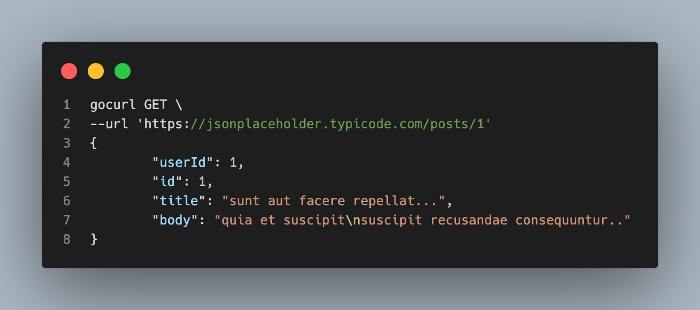

# GoCurl - A Golang Implementation of cURL

GoCurl is a command-line tool written in Golang that serves as a lite clone of the popular cURL utility. It will allow users to perform HTTP and HTTPS operations from the command line, just like cURL, but with the added benefits of being written in the efficient and modern Go programming language.

## Current Features
- [x] Perform HTTP(S) GET, POST, PUT, DELETE etc. requests with body and url.
- [x] Pass header parameters to requets
- [x] Pretty Print of JSON to command-line
- [ ] Support for FTP

## Installation 

`gocurl` is available via [Homebrew](https://brew.sh/) and as a downloadable binary from the [release page](https://github.com/mrsimi/gocurl/releases)

To install using Homebrew 

```
brew tap mrsimi/mrsimi
brew install mrsimi/mrsimi/gocurl
```

For the help dialogue 
```
gocurl --help
```

Example 



